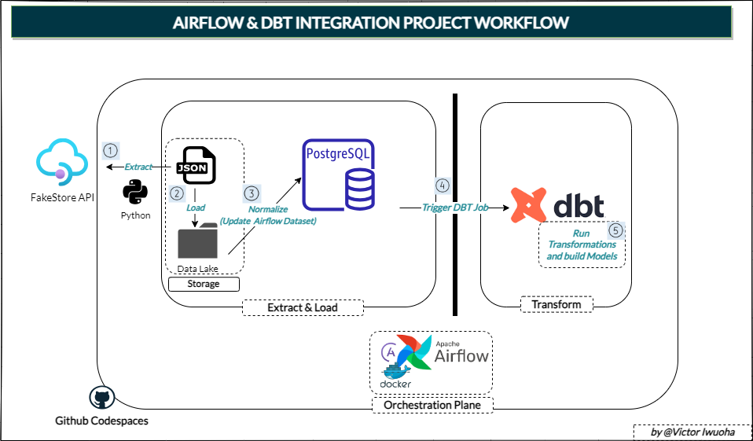

AIRFLOW & DBT CLOUD INTEGRATION PROJECT FOR DATA & ANALYTICS ENGINEERS
========

*Author: [Victor Iwuoha](https://linkedin.com/in/viciwuoha)*

*Date: 16th June 2023*

*Event: DBT-Lagos-Meetup*

&nbsp;
Project Contents
================
This Project is built using the astro cli provisioned by [Astronomer](https://docs.astronomer.io/)
To Run this project a linux environment is highly recommended.

Workflow
================

### Key Takeaways:
- Airflow Core Concepts such as (Operators, taskflow API, dynamic task mapping, Data-Aware Scheduling, Variables & Connections )
- DBT UI Familiarization Up to Job Creation with basic concepts of Macros, Documentation, Snapshots for SCD's, and Exposures.

### Prerequisites:

- Linux Environment/ github codespaces/Ubuntu distribution on Windows
- Docker Compose
- A DBT Cloud Account (With an API Key)
- A .env file at the root of this directory with environment variables exactly as those in .env.example but with actual values. (Do this edit In Codespaces / with a **machine of 4 Cores, 8GB RAM & 32GB Storage**)
- An accessible Postgres database with a valid connection URL. (Spin Up a free one on [ElephantSql.com](https://elephantsql.com)). _In the Url, replace *postgres with **postgresql**_
- Basic Understanding of Python & SQL

Deployment & Execution
======================

### Steps for deployment:

- Fork This Project to your git profile, create a branch named dev, then connect the repository to your dbt account.
- Give DBT adequate access to connect to this repository on your git provider (github/gitlab) -> [see steps](https://docs.getdbt.com/docs/cloud/git/connect-github)
- **Create a dbt project** with the name airflow_dbt_magic or any name of choice and point it to the dbt subdirectory of this repository.
- **Create two DBT environment Variables** as follows;
    - Key: DBT_LAGOS_MEETUP_DB Value: As used above within airflow .env
    - Key: DBT_LAGOS_MEETUP_SCHEMA, Value: dbt_DBT_LAGOS_MEETUP_USER (where DBT_LAGOS_MEETUP_USER has the same value as used in .env above). This can basically be aby schema or database.
- Create a Production environment and link it to the main branch, then create a simple DBT JOB in the Production Environment called AIRFLOW DBT JOB and add the commands (`dbt build` & `dbt snapshot`) Also select the generate docs on run checkbox. Note the **Job Id** as well as the **Account id** as they would be needed in Airflow.

### Execution:

1. After adding the environment variables in [**Prerequisites** above](#prerequisites) to your .env file, Run the start.sh script using the command `bash start.sh` This should start your project, export all environment variables and create a **data_lake/** dir. To restart your airflow container after any environment/config changes, simply run the command `astro dev restart`.
2. Create 2 airflow Connections and one Airflow Variable
    -  a. **DBT Cloud connection with the following;**
        -   Connection Id: dbt_cloud_default
        -   Account Id: YOUR_DBT_ACCOUNT_ID
        -   Api Token: YOUR_DBT_API_TOKEN
    &nbsp;

    -  b. **Postgres DB Connection as follows;**
        - Connection Id: postgres_default
        - Host: rajje.db.elephantsql.com (same as supplied in .env) or any other hosting platform including localhost.
        - Schema: As supplied during meetup or any other database on your host
        - Login: User name for schema
        - Password: Password of User to DB
        - Port: 5432
    &nbsp;

    -   c. **DBT JOB ID Variable as follows;**
        - Key: dbt_meetup_job
        - Value: YOUR_CREATED_DBT_JOB_ID
        - Description: DBT meetup Job ID

3. Turn on the two **fakestore_** dags and Trigger the Dag Named _**fakestore_elt_pipeline**_. If this Runs SuccessFully , the _**fakestore_dbt_job_pipeline**_ would automagically get triggered based on the dataset schedule. See more on [Airflow Datasets](https://airflow.apache.org/docs/apache-airflow/stable/authoring-and-scheduling/datasets.html).

4. Wait for the dbt dag to complete running and navigate to the dbt cloud UI to see that the dag was triggered via the API. For more notes on the operation of this dag, see [DbtCloudOperator](https://airflow.apache.org/docs/apache-airflow-providers-dbt-cloud/stable/operators.html). In More complex Setups, there are packages that can be used with dbt core to convert your entire dbt project into airflow tasks for easier management. An example is [Astronomer Cosmos](https://github.com/astronomer/astronomer-cosmos).

Credits:
===========================

The Structure of this project was adapted from the astronomer provided astro cli and created using astro dev init
Docs are available at the following Links

- [Apache Airflow]()
- [Astronomer](https://docs.astronomer.io/)
- [DBT Cloud](https://docs.getdbt.com/) and [DBT-Cloud-Airflow Example](https://docs.getdbt.com/guides/orchestration/airflow-and-dbt-cloud/1-airflow-and-dbt-cloud)

The compilation of this project was inspired with ❤️ by the **dbt-lagos-community** 📦 .

===========================